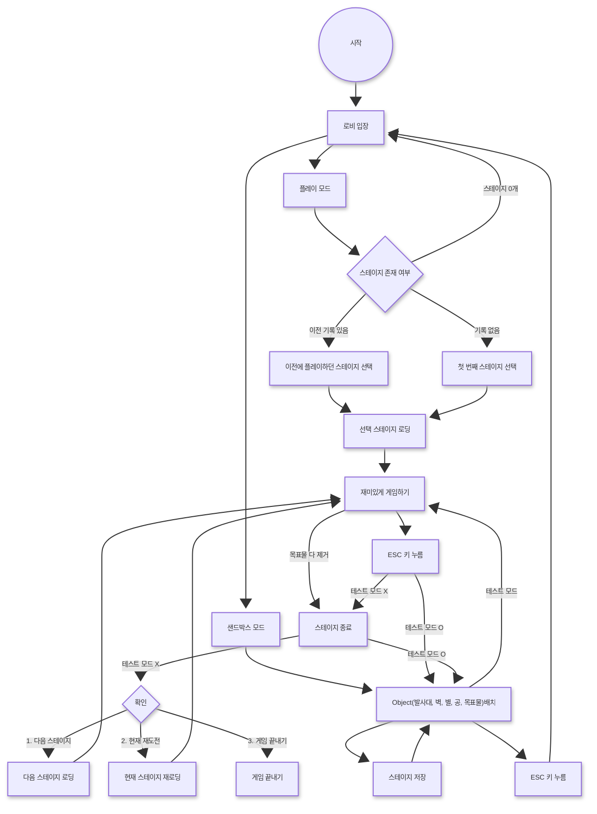

# JustBall

2D 샌드박스 물리 퍼즐 게임. 선을 그리고, 공을 발사하고, 물리 법칙을 활용해 자유롭게 플레이하세요.

> HTML5 Canvas + VITE + Matter.js 기반 브라우저 게임

## 게임 흐름도


## 스크린샷

*(추후 추가)*

## 주요 기능

### 공 종류 (8가지)

#### 공의 속성

- **밀도(density)** - 공의 무게를 결정 (높을수록 무거움)
- **반발계수(restitution)** - 충돌 시 튕김 정도 (1.0 = 에너지 손실 없음)
- **파괴력(damage)** - 선에 부딪힐 때 주는 데미지(HP). 파워 모드 시 +10
- **특수 능력** - 공 고유의 특수 효과

| 공          |  밀도   | 반발계수 | 파괴력 | 특수 능력                                                         |
| ---------- | :---: | :--: | :-: | ------------------------------------------------------------- |
| **일반 공**   | 0.006 | 0.6  |  5  | 없음                                                            |
| **철공**     | 0.030 | 0.2  | 20  | 무거워서 선을 쉽게 부숨                                                 |
| **탱탱 공**   | 0.003 | 0.95 | 10  | 트램펄린 위 부스트 강화 (3.5배)                                          |
| **폭탄 공**   | 0.008 | 0.4  | 10  | 5초 퓨즈 후 폭발 (반경 150px), 연쇄 폭발                                  |
| **불 공**    | 0.005 | 0.6  | 10  | 불꽃 궤적, 벽에 닿으면 폭발, 폭발 시 불꽃 잔상(반경 150px, 3초 지속), 불꽃 잔상 내 목표물 파괴 |
| **플라즈마 공** | 0.007 | 0.5  | 10  | 2초마다 전기 연쇄 (범위 50px, 최대 3회), 목표물도 공격 가능                       |
| 바이러스 공     | 0.007 | 0.6  | 10  | 인근 공들을 감염(범위 100px)                                           |

### 벽 종류 (5가지)

#### 벽의 속성

- **반발계수(restitution)** - 공이 부딪힐 때 튕김 정도
- **마찰(friction)** - 표면 마찰력 (높을수록 공이 느려짐)
- **내구도(HP)** - 공에 부딪혀 받는 데미지 누적, 0이 되면 파괴
- **특수 능력** - 벽 고유의 특수 효과

| 벽          | 반발계수 |  마찰  |  내구도  | 특수 능력                             |       |
| ---------- | :--: | :--: | :---: | --------------------------------- | ----- |
| **일반 벽**   | 0.3  | 0.6  | 50 HP | 없음                                |       |
| **트램펄린 벽** | 2.0  | 0.05 | 30 HP | 공을 강하게 튕김, 충돌 시 찌그러짐 <br>애니메이션    |       |
| **킬 벽**    | 0.3  | 0.6  |  무한   | 닿는 공을 즉시 제거, 파괴 불가                |       |
| **회전 벽**   | 0.3  | 0.6  | 50 HP | 360도 회전 (속도 0.008 rad/tick)       |       |
| **이동 벽**   | 0.3  | 0.6  | 50 HP | 선 길이 방향으로 왕복 이동 <br>(최대 진폭 100px) |       |
| 철벽         | 0.3  | 0.6  |  무한   | 없음                                | 벽돌 무늬 |

### 아이템

| 아이템               | 설명                                                                                                                            |
| ----------------- | ----------------------------------------------------------------------------------------------------------------------------- |
| **별(Star)**       | 공이 닿으면 파괴되며 점수 +10 획득. 금색 파티클 이펙트 발생                                                                                          |
| **발사대(Launcher)** | 맵에 하나만 배치 가능. 공의 발사 지점 역할. Ball 도구 클릭 시 발사대 중앙에 공 생성 → 드래그로 방향/파워 설정 → 발사. 5초 카운트다운 후 자동 발사 (초록→노랑→빨강 타이머 표시). 포신이 발사 방향으로 회전 |
| **목표물(Target)**   | 공이 목표물을 맞추면 목표물이 폭발 → 모든 목표물 파괴 시 스테이지 클리어 → 클리어 시 스테이지 종료 화면 표시. 깃발 펄럭임 이펙트                                                  |
| **플라즈마 박스**      | 능력: 공이 근처로 다가오면 전기를 발사하여 공을 파괴, 3초마다 전기 연쇄 (범위 150px)<br>- 일반 상태 이미지: plasma_box_1.png<br>- 전기 발사 상태 이미지: plasma_box_2.png<br>- 샌드박스 모드 툴바에서 ⚡ PlasmaBox 버튼으로 배치 가능<br>- 스테이지 JSON의 `plasmaBoxes` 필드에 저장                 |
### 점수 & 파워 모드

- **점수 획득** - 공으로 별을 맞추면 점수 +10
- **파워 모드** - Q키로 ON/OFF 토글. ON 상태에서 공 발사 시 점수 10을 소비하여 **파괴력 +10 및 발사 속도 2배** 적용
- 파워 모드 발사 시 금색 발사 이펙트 + 공에 금색 글로우 표시
- 점수 부족 시 파워 모드가 켜져 있어도 일반 발사

### 게임 메카닉

- **슬링샷 발사** - 드래그하여 공 발사, 파워 표시기 제공, 공 궤적 표시. 발사대가 있으면 발사대 중앙에서 발사
- **벽 그리기** - 마우스로 드래그하여 직선으로 벽 그리기
- **지우개** - 클릭으로 오브젝트 제거
- TODO: ~~**부스트** - 근처 공에 상향 충격 부여~~
- **별 배치** - 캔버스에 클릭하여 별 아이템 배치
- **발사대 배치** - Launcher 도구로 클릭하여 배치/이동. 맵에 하나만 존재
- **목표물 배치** - 캔버스에 클릭하여 목표물 배치. 공이 맞추면 스테이지 클리어
- **플라즈마 박스 배치** - 샌드박스 모드에서 ⚡ PlasmaBox 도구로 클릭하여 배치. 범위(150px) 내 공을 3초마다 전기로 파괴
- **스테이지 클리어** - 목표물 적중 시 스테이지 종료 화면 표시
- **일시 정지** - Space 키로 물리 시뮬레이션 일시 정지/재개
- **오브젝트 이동** - Ctrl+드래그로 기존 오브젝트 이동. 벽도 함께 이동하며 저장 좌표가 동기화됨
- **샌드박스 오브젝트 드래그 이동** - 샌드박스 모드에서 각 도구(Ball, Wall, Launcher, Star, Target, PlasmaBox) 선택 후 해당 오브젝트를 클릭-드래그하여 이동. 빈 공간 클릭은 기존처럼 새 오브젝트 배치
- **인벤토리** - X 키로 공 종류 및 선 재질 선택

### 스테이지 시스템

#### 스테이지 데이터 구조
```json
{
  "name": "스테이지 이름",
  "data": {
    "version": 1,
    "designSize": { "w": 1024, "h": 768 },
    "level": 1,
    "locked": false,
    "lines": [{ "points": [{"x":0,"y":0}], "color": "#333333", "rotating": false, "moving": false }],
    "balls": [{ "x": 0, "y": 0, "type": "normal" }],
    "stars": [{ "x": 0, "y": 0 }],
    "targets": [{ "x": 0, "y": 0 }],
    "plasmaBoxes": [{ "x": 0, "y": 0 }],
    "launcher": { "x": 0, "y": 0 }
  }
}
```

| 속성 | 타입 | 설명 |
|------|------|------|
| `version` | number | 데이터 포맷 버전 |
| `designSize` | `{w, h}` | 디자인 기준 해상도. 로딩 시 현재 캔버스에 맞게 자동 스케일링 |
| `level` | number | 난이도 순서 (1부터 시작). 각 스테이지 고유값 |
| `locked` | boolean | `true`면 플레이 불가. Level 1은 항상 `false` |
| `maxBalls` | number | 발사 가능한 공 최대 개수. 0이면 무제한 |
| `lines` | array | 벽/선 배열 (points, color, type, rotating, moving) |
| `balls` | array | 공 배열 (x, y, type) |
| `stars` | array | 별 배열 (x, y) |
| `targets` | array | 목표물 배열 (x, y) |
| `plasmaBoxes` | array | 플라즈마 박스 배열 (x, y) |
| `launcher` | object | 발사대 위치 (x, y) |

#### 스테이지
- 플레이 모드 진입 시 fetch로 로딩, level 순 정렬
- 진행도는 Sqlite에 클리어한 최고 level 저장
- 스테이지 클리어 시 다음 level의 lock이 해제됨
- 배경 이미지와 음악을 가짐

#### 샌드박스 스테이지 저장
- **맵 저장** - 현재 배치된 벽·별·발사대·목표물 레이아웃을 스테이지로 저장 (인벤토리 > 스테이지 맵)
- **맵 불러오기** - 인벤토리에서 저장된 스테이지를 선택하여 불러오기
- **파일 내보내기** - 저장된 맵을 .json 파일로 다운로드
- **파일 가져오기** - .json 파일에서 맵을 불러와 저장 (다른 브라우저에서도 사용 가능)
- 저장된 맵은 Sqlite에 보관, 파일 내보내기/가져오기로 브라우저 간 공유 가능

### 이펙트

- 불 공 궤적 및 펄싱 글로우
- 불 공 폭발 후 불꽃 잔상 (반경 150px, 3초 지속, 내부 목표물 파괴)
- 폭탄 카운트다운 아크 및 점멸
- 트램펄린 충돌 시 찌그러짐 애니메이션
- 선 파괴 시 파편 파티클
- 충돌 스파크 및 폭발 파티클
- 발사 트레일 (충격파 링, 스피드 라인)
- 별 수집 시 금색 방사형 파티클 + 플래시 이펙트
- 파워 모드 발사 시 금색 이펙트 + 공 글로우
- 점수 획득 팝업 애니메이션 (+10)
- 절차적 생성 우주 배경 (성운, 별, 먼지)

### 사운드

- 충돌·바운스·폭발·선 파괴 효과음 (Web Audio API 절차적 생성)
- 별 수집 종소리 효과음
- BGM 토글 (M 키)

## 조작법

| 입력 | 동작 |
|------|------|
| 마우스 클릭/드래그 | 공 발사 / 선 그리기 / 별 배치 |
| Space | 일시정지/재개 |
| X | 인벤토리 열기/닫기 |
| Q | 파워 모드 토글 |
| Esc | 인벤토리 닫기 |
| M | BGM 토글 |
| Ctrl + 드래그 | 오브젝트 이동 |

## 기술 스택

- **빌드** - Vite 5.4
- **물리 엔진** - Matter.js 0.20
- **그래픽** - HTML5 Canvas 2D API
- **오디오** - Web Audio API
- **언어** - ES6+ JavaScript (모듈)

## 프로젝트 구조

```
├── index.html          # 진입점
├── package.json
├── vite.config.js
├── public/
│   └── bgm.mp3         # 배경 음악
└── src/
    ├── main.js          # 게임 루프, 렌더링, 초기화
    ├── physics.js       # 물리 엔진 및 게임 메카닉
    ├── toolbar.js       # UI 툴바 및 인벤토리
    ├── sound.js         # 효과음 시스템
    ├── background.js    # 절차적 우주 배경 생성
    ├── simplify.js      # Douglas-Peucker 경로 단순화
    └── style.css        # UI 스타일
```

## 시작하기

```bash
# 의존성 설치
npm install

# 개발 서버 실행
npm run dev

# 프로덕션 빌드
npm run build

# 빌드 미리보기
npm run preview
```

## 물리 설정

- 중력: 1.2 m/s²
- 솔버: 위치 12회, 속도 8회 반복
- 고정 타임스텝: 120 FPS (8.33ms)
- 연속 충돌 감지(CCD) 활성화
- DPI 인식 캔버스 스케일링

## 라이선스

*(추후 추가)*

### 추가 공 아이디어

| 공 | 색상 | 특수 능력 | 파티클 |
|---|------|----------|--------|
| **레이저 공** | 빨강 네온 | 2개가 있으면 그 사이에 레이저 생성 (`o-------o`) | 빨강 네온 |
| **잉크 공** | 흰색 (검은 테두리) | 떨어지면 잉크가 튐, 움직일 때 잔상 (점점 투명해지며 삭제) | 잉크 방울 |
| **포스필드 공** | - | 다른 공이 닿으면 안으로 흡수. 위험 물체(킬, 불, 번개 등)에 닿으면 포스필드가 먼저 파괴 | - |

### 추가 벽 아이디어

| 벽 | 색상 | 특수 능력 |
|---|------|----------|
| **스위치 벽** | 하늘색 | 클릭으로 ON/OFF 토글. ON: 공 통과 불가 (내구도 50). OFF: 반투명, 공 통과 가능 |
| ~~금속 벽~~ 철벽 | 회색 | 파괴 불가, 나머지는 일반 벽과 동일 |
| **탄소섬유 벽** | 검정 | 파괴 불가, 나머지는 트램펄린 벽과 동일 |

### UI 개선

- **공 상태창** — 공을 좌클릭하면 정보 창 표시 (이름, 외형, 생성 시간 등). 이름 입력 시 공 위에 이름 표시
- **스테이지 타이머** — 현재 스테이지에서 경과한 시간 표시 (`시:분` 형식)
- **밤/낮 모드** — 버튼으로 전환. 밤에는 공과 선만 구분 가능, 빛을 가진 공(불 공 등)은 발광 효과

### 키바인딩 변경안

| 키 | 동작 |
|---|------|
| O | 클리어 |
| E | 공 도구 |
| W | 벽 도구 |
| Q | 부스트 |

### 인벤토리 확장

- **텍스쳐 팩** — 장착 시 공, 선, 기타 오브젝트 외형 변경
  - **클래식** (기본값) — JustBall 1~3 버전 외형. 공은 그대로, 나머지 변경
  - **모던** — JustBall 4+ 버전 외형. 선은 그대로, 공에 명암 추가, 별·대포 그대로, 깃발 변경
  - **두들** — 손그림 스타일. 깃발 제외 전부 변경
- **대포 종류 / 깃발 종류** — 추후 아이디어 추가 예정

### 수정 예정

- **플라즈마 공** — 색상을 보라색으로 변경, 보라 번개 이펙트로 교체

### 로비 시스템

- **로비 화면** — 게임 시작 시 로비 입장, 모드 선택
  - **플레이 모드** — 스테이지 형식 플레이
    - 스테이지 존재 여부 확인 → 이전 기록이 있으면 해당 스테이지, 없으면 첫 번째 스테이지 로딩
    - 스테이지가 0개면 로비로 복귀
    - 목표물 전부 제거 시 스테이지 종료 → 다음 스테이지 / 현재 재도전 / 게임 끝내기 선택
    - ESC 키로 스테이지 종료
  - **샌드박스 모드** — 오브젝트(발사대, 벽, 별, 공, 목표물) 자유 배치 및 스테이지 저장
    - 테스트 모드: 에디터에서 바로 플레이 테스트 가능, ESC로 에디터 복귀
    - ESC 키로 로비 복귀

### 개선 사항
- [x] 스테이지 종료 후 보이는 스테이지 미리보기에 실제 스테이지 모양 보이기
- [x] 발사할 볼이 없으면 스테이지 종료(단. 다음 스테이지의 Locked는 풀리지 않음)
- [x] 로비에서 화살표 좌/우 키로 모드 선택, 선택한 모드를 엔터키로 진입 가능
- [x] 툴바 UI 재설계 — 좌(☰ 메뉴/📁 파일/🗑 Clear), 중앙(선택·벽·공·지우개·📦 기믹 드롭다운), 우(❓ 도움말·▶ 테스트 플레이) 3개 플로팅 패널, Boost 도구 제거
- [x] 발사대: 기존 3초에서 5초 카운트다운 후 자동 발사로 수정
- [x] 공 **파괴력**을 데미지 비율에서 데미지(HP)로 수정, 실제 데미지는 공 테이블 참조
- [x] 자석공 삭제
- [x] 플레이 모드에서 스테이지를 시작하면 Full Screen으로 변경 (로비 복귀 시 자동 해제)
- [x] SQLite에 **공략 법** 칼럼 추가 (stages.strategy, 마이그레이션 자동 수행)
- [x] **파워 모드**일때 공에 이펙트 추가 (펄싱 글로우 + 궤적 트레일 + 궤도 스파크)

### 버그
- [x] 시한 폭탄 공이 철벽을 부숨
- [x] 첫 인벤토리 화면에서 3개의 선이 선택되어 있음
- [x] 인벤토리에서 스테이지가 Level 순으로 보이지 않음
- [x] 점수가 유지되지 않음. -> 스테이지가 시작될때 마다 점수가 초기화 됨
- [x] ground 충돌 영역이 시각적 라인보다 넓음 (chamfer 제거 + LINE_THICKNESS 15→10 축소)
- [x] 스테이지 저장 시 저장 완료 메시지가 잘 보이지 않음 — 인벤토리 `#inv-desc`에 `.success` 클래스와 펄스 애니메이션 추가 (녹색·굵게), 저장 시 캔버스 토스트도 함께 표시
- [x] 회전 벽의 회전 속도가 빨라짐 — 회전이 물리 스텝당 고정 증분(0.008 rad/step)이라 physics timestep을 60Hz→120Hz로 올리면서 2배 빨라짐. 초당 라디안(0.48 rad/s) 기반으로 변경하여 timestep과 무관하게 일정한 속도 유지
- [ ] 속도가 빨라지면 공이 벽을 뚫고 지나가는 버그 — 이전에 raycast 기반 속도 clamp로 시도했으나 트램펄린/파워 모드 고속 바운스까지 감속시켜 게임플레이가 망가져 되돌렸음. 올바른 해결책은 물리 엔진의 서브스텝(sub-step) 또는 적절한 CCD 구현 필요

## 향후 계획